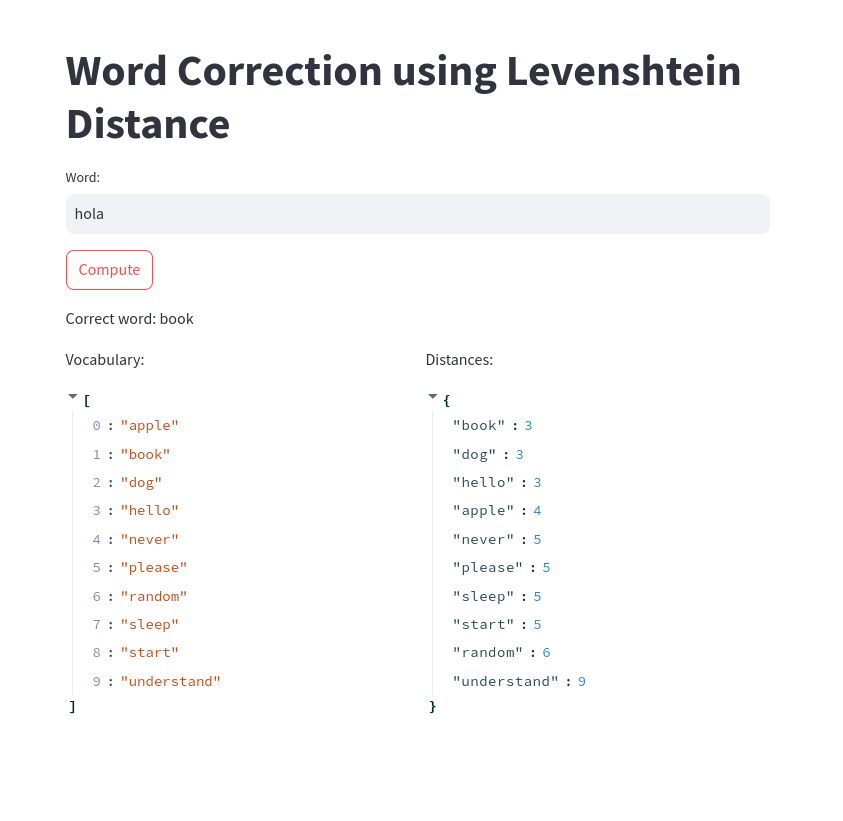
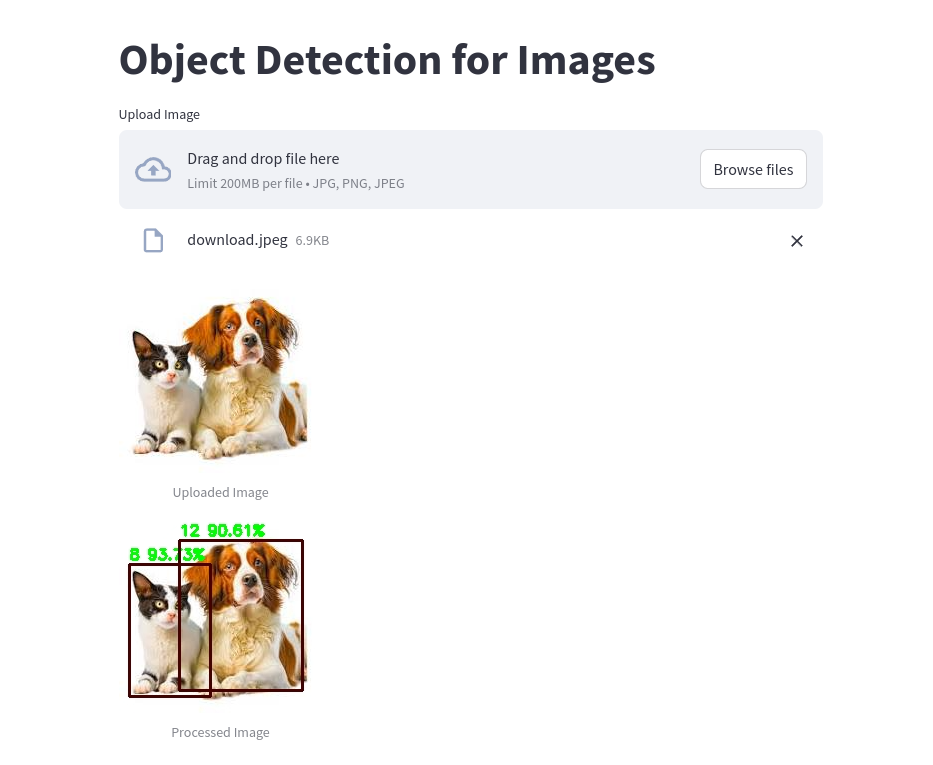
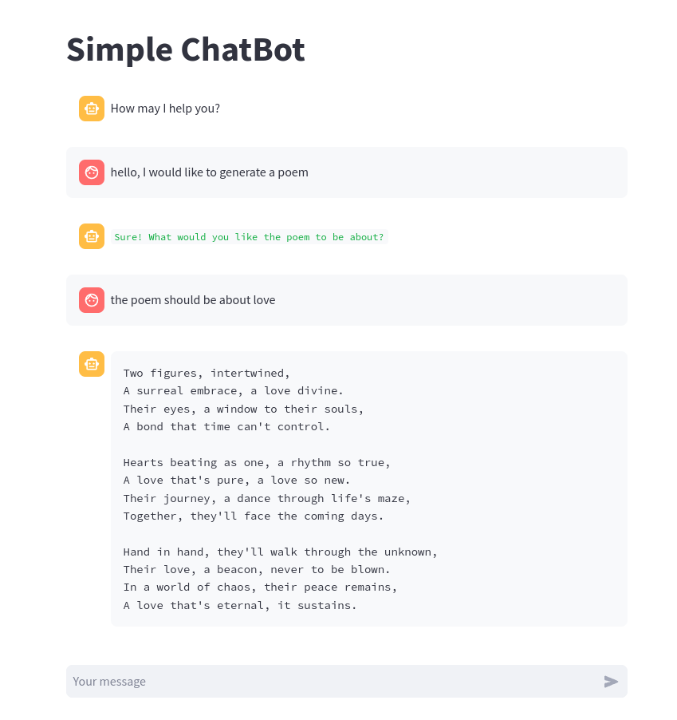

# All-In-Streamlit
This project contains three main AI applications developed using the Streamlit library: Word Correction, Object Detection, and Chatbot. Each application demonstrates a different aspect of AI and machine learning, providing a hands-on approach to deploying models with a user-friendly interface.

## Table of Contents
1. [Introduction](##introduction)
2. [Installation](##installation)
3. [Word Correction](##word-correction)
4. [Object Detection](##object-detection)
5. [Chatbot](##chatbot)
6. [Demo](##demo)

## Introduciton

In this project, we will focus on learning the Streamlit library, one of the code libraries open source is widely developed and applied to deploy AI applications in general.Streamlit provides effective tools for interacting with users to enter information or display information. In the following sections, we focus on developing the following basic applications:

- **Word Correction**: Word Correction is one of the basic applications of word language processing. However, the purpose is to build applications that receive single-word input, through an error correction model if the word is incorrect it becomes a correct word.
- **Object Detection**: Object Detection is a typical important application of image processing, with the goal of detection frames contain objects in the image.
- **Chatbots**: Chatbot is an application that has attracted attention and developed strongly in recent years, the main chatbot applications. We mainly focus on large language models that can interact well with user requirements.

## Installation
To run these applications locally, you should follow this instruction:

1. Clone this repository:
   ```bash
   git clone https://github.com/minhhoang2705/All-In-Streamlit.git
   cd All-In-Streamlit
   ```
2. Install the required dependencies:
   ```bash
   pip install -r requirements.txt
   ```
   For those who want to use conda environment:
   ```bash
   conda env create -f <environment-name>.yml
   ```
3. Run the applications using Streamlit:
- For Word Correction:
```bash
streamlit run levenshtein_distance.py
```
- For Object Detection:
```bash
streamlit run object_detection.py
```
- For Chatbot:
```bash
streamlit run chatbot.py
```

## [Word Correction](https://word-correction.streamlit.app/)

### Description
The Word Correction application takes a user-inputted word and suggests the correct spelling using the Levenshtein distance algorithm. This applications showcases natural language processing capabilities and error correction.

### Usage
1. Run the application:
```bash
streamlit run levenstein_distance.py
```
2. Enter a word in the input box and click "Compute".
3. The application will display the corrected word and the Levenshtein distances for each word in the vocabulary.

## [Object Detection](https://basic-object-detection.streamlit.app/)

### Description
The Object Detection application allows users to upload an image, and it will detect and highlight objects within the image using a pre-trained deep neural network model.

### Usage
1. Run the application:
```bash
streamlit run object_detection.py
```
2. Upload an image file.
3. The application will display the uploaded image with detected objects highlighted.

## [Chatbot](https://chatbot-with-hugchat.streamlit.app/)

### Description
The Chatbot application provides an interactive chat interface for users. It uses Hugging Face's HugChat to generate responses based on user input.

### Usage
1. Run the application:
```bash
streamlit run chatbot.py
```
2. Enter your Hugging Face credentials.
3. Start chatting with the bot.

## Demo

### Word Correction
<p align='center'>
  
</p>

### Object Detection
<p align='center'>
  
</p>

### Chatbot
<p align='center'>
  
</p>
   
